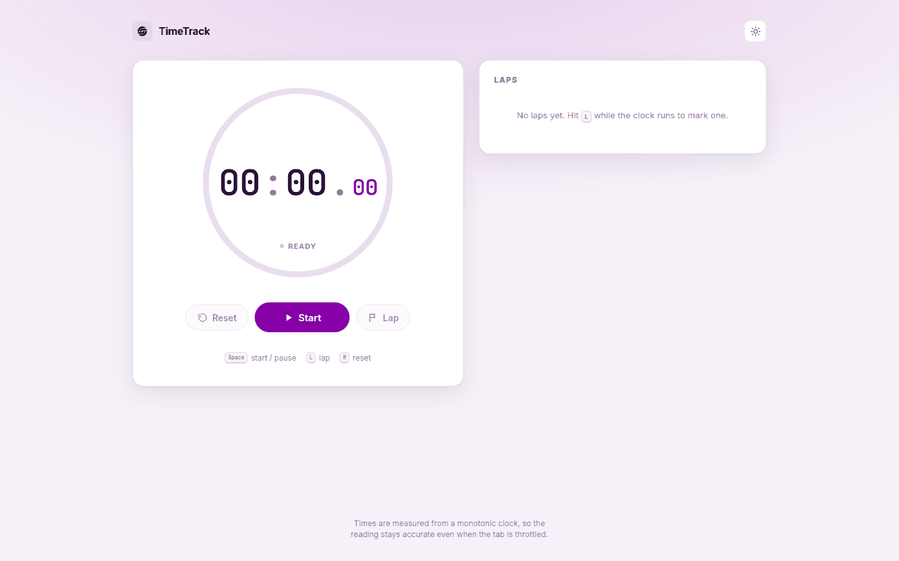
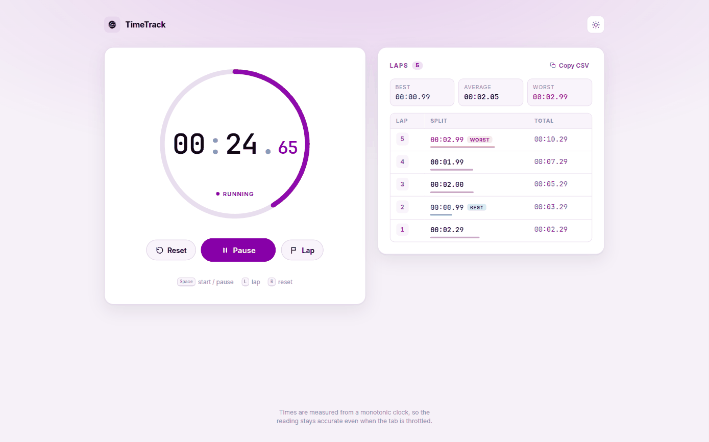
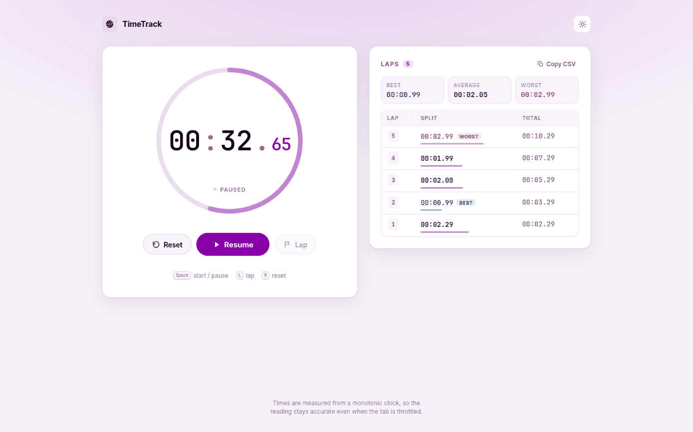
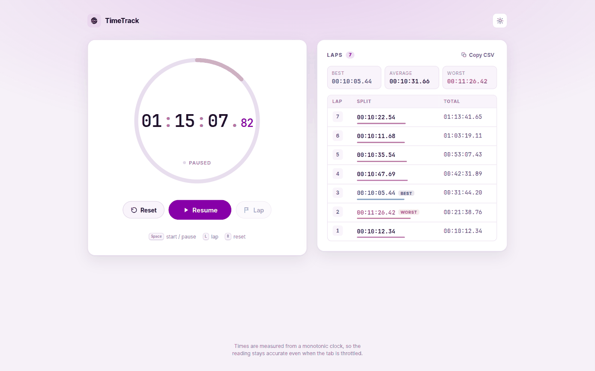
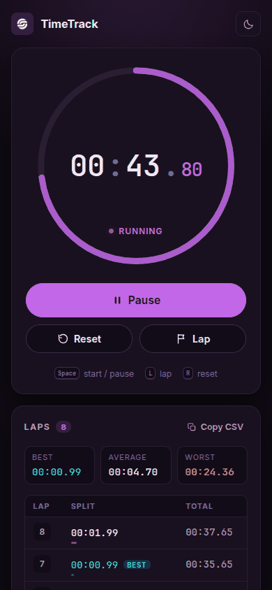
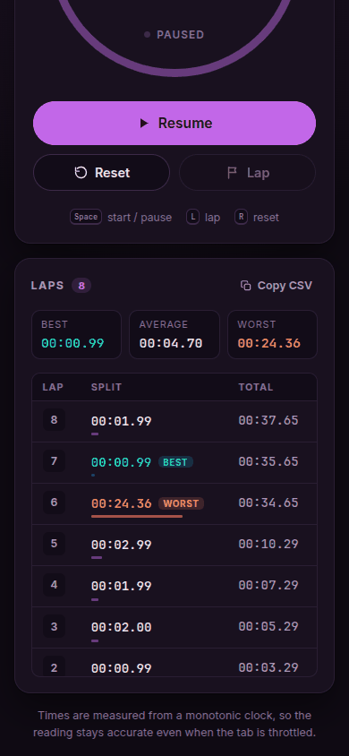
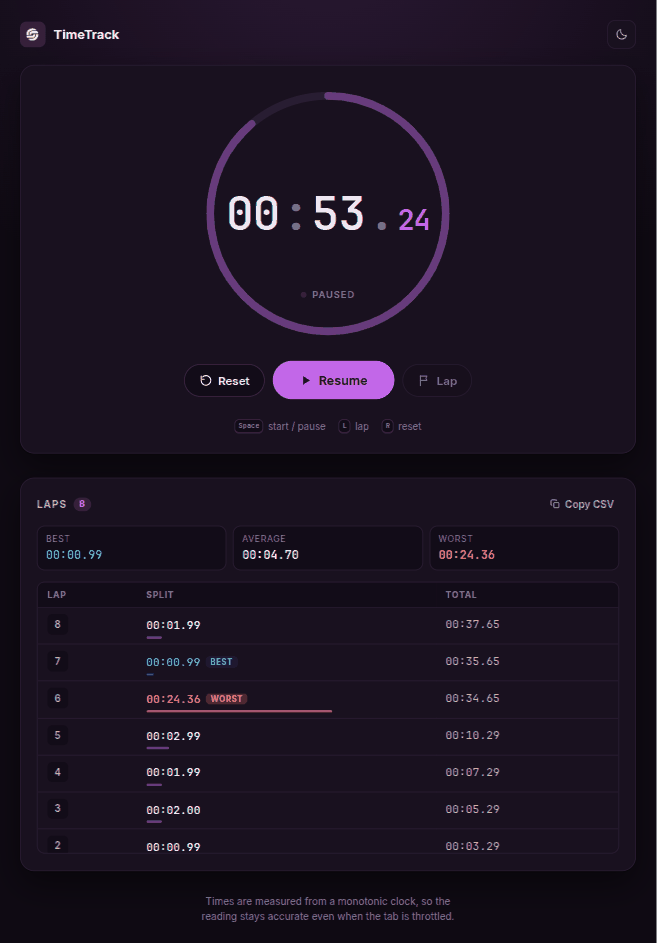

<!-- Generated from README.md by scripts/build-light-readme.mjs. Do not edit by hand. -->

<div align="center">

<picture>
  <source media="(prefers-color-scheme: dark)" srcset="./docs/assets/adk_dev_logo_light.png">
  
</picture>

# TimeTrack

**A stopwatch for the browser: start, pause, resume and mark laps, with the splits kept in a table you can read or export.**


<br>


<br><br>

[](https://github.com/Dileepadari/TimeTrack/actions/workflows/ci.yml)

**[Developer documentation](./DEVDOC.md)** &middot; [Screenshots](#screenshots) &middot; [Features](#features) &middot; [Getting started](#getting-started)

<p><b>Light mode</b> &middot; <a href="./README.md">View this page in dark mode</a></p>

</div>

---

It exists because most web stopwatches count ticks instead of measuring time, so
they fall behind whenever the browser throttles a background tab. TimeTrack reads
a monotonic clock on every frame, which means the number on screen is the elapsed
time whether the tab was in front the whole run or not.

---

## Screenshots

Every image is a real 1440x900 viewport render of the running app. This page shows **dark mode**; the same gallery in light mode is at **[README-light.md](./README-light.md)**.

<table>
  <tr>
    <td width="33%" valign="top">
      
      <p align="center"><b>Ready</b><br><sub>Reset is dimmed until the clock has actually moved.</sub></p>
    </td>
    <td width="33%" valign="top">
      
      <p align="center"><b>Running</b><br><sub>The ring sweeps once a minute; laps arrive newest first.</sub></p>
    </td>
    <td width="33%" valign="top">
      
      <p align="center"><b>Paused</b><br><sub>The reading holds. Resume carries on from the same number.</sub></p>
    </td>
  </tr>
</table>

<details>
<summary><b>Past an hour</b></summary>
<br>

<p align="center"><sub>The readout widens to <code>HH:MM:SS.cc</code> once an hour has passed, and the splits column widens with it.</sub></p>
</details>

### Responsive layout

Each image is its own device viewport, not a crop of the desktop layout. The two
panels stack, the primary action goes full width under the thumb, and the lap
table keeps its three columns rather than scrolling.

<table>
  <tr>
    <td width="25%" valign="top">
      
      <p align="center"><sub><b>Clock</b><br>390 x 844</sub></p>
    </td>
    <td width="25%" valign="top">
      
      <p align="center"><sub><b>Laps</b><br>390 x 844</sub></p>
    </td>
    <td width="50%" valign="top">
      
      <p align="center"><sub><b>Clock and laps</b><br>820 x 1180</sub></p>
    </td>
  </tr>
</table>

---

## Features

### The clock
- Start, pause, resume, and reset
- Reads to hundredths of a second, and widens from `MM:SS.cc` to `HH:MM:SS.cc`
  once an hour has passed
- A ring around the readout sweeps once per minute, so you can see the seconds
  moving without reading digits
- Stays accurate in a background tab; the reading is measured, never accumulated

### Laps
- Mark a lap at any point while the clock runs
- Each lap shows its split (time since the previous lap) and the running total
- Fastest and slowest lap are flagged once there are at least two of them
- Best, average, and worst appear above the table
- A bar under each split is scaled against the slowest lap, so the shape of a
  session is readable at a glance
- Copy CSV puts every lap on the clipboard, oldest first, ready for a spreadsheet

### Everything else
- Keyboard control: <kbd>Space</kbd> to start or pause, <kbd>L</kbd> to lap,
  <kbd>R</kbd> to reset
- Light, dark, or follow-the-system theme, remembered between visits
- Your time and laps survive a refresh or a closed tab, restored paused
- Works down to a phone-width screen

## How a session goes

1. Press Start, or hit <kbd>Space</kbd>. The status under the clock reads Running.
2. Press Lap whenever you want a marker. The newest lap appears at the top of the
   table with its split.
3. Press Pause to hold the reading. Nothing is lost - Resume picks up from the
   same number.
4. Press Reset to clear both the clock and the laps. Reset is only available once
   the clock has actually moved.

Reset is not undoable, so copy the CSV first if the laps matter.

## Reload behaviour

Closing the tab or refreshing keeps your elapsed time and your laps, and brings
them back **paused**. The clock deliberately does not keep counting through a
reload: nothing on the page can know how long the tab was gone, and inventing that
number would make the reading wrong. Press Resume to carry on.

## Tech stack

React 19 on Vite, no state or UI libraries. Tested with Vitest and Testing Library.
The detail lives in [DEVDOC.md](./DEVDOC.md).

## Getting started

```bash
npm install
npm run dev
```

Setup, scripts, and deployment are covered in [DEVDOC.md](./DEVDOC.md).
